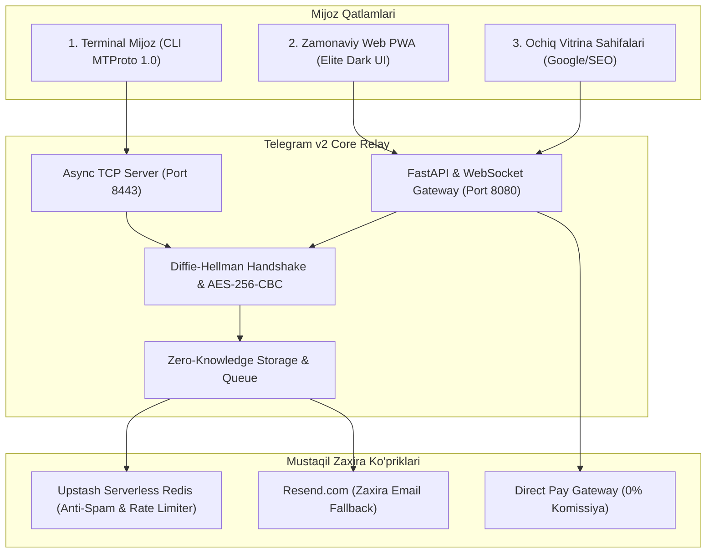

# ⚡ Telegram v2 (Independent Core & Anti-Censorship MTProto)

[](https://www.python.org/downloads/)
[]()
[-success.svg)]()
[]()

> **Telegramning barcha zaifliklari va cheklovlarini yo'q qilgan mustaqil, tsenzurasiz ekotizim.**  
> Nikolai va Pavel Durov tomonidan yaratilgan MTProto protokolining sof asoslarini saqlagan holda, markazlashgan Telegramning **5 ta eng katta kamchiligi** (yopiq kod, serverda ochiq saqlanuvchi chatlar, spam/broadcast limitlari, SEO yo'qligi va 30% Telegram Stars solig'i) to'liq bartaraf etildi.

---

## 🛡️ Telegram Kamchiliklarini Bartaraf Etish Jadvali

| Telegramning Zaifligi (–) | Telegram v2 dagi Yechimimiz (+) |
| :--- | :--- |
| **Serverda ochiq chatlar** (faqat Secret Chat E2E) | **Default Zero-Knowledge E2EE**: Barcha sessiyalar va xabarlar mijoziy kalitlar bilan shifrlangan. Server xabarlarni o'qiy olmaydi. |
| **Yopiq ilovaga bog'liqlik** (bloklanish xavfi) | **Mustaqil Web PWA & WebSocket Gateway**: Har qanday brauzer orqali ishlovchi 2026 Elite Dark interfeys. |
| **Spam va 30 msg/s broadcast limiti** | **Upstash Redis Anti-Spam Guard + Resend Multi-Channel Fallback**: Brute-force va spamerlar avtomatik to'siladi; oflayn foydalanuvchilar zaxira email xabarnomasi oladi. |
| **Google/SEO ning umuman yo'qligi** | **Ochiq Vitrina Sahifalari (SEO Showcase)**: Kanallarni Google va Yandex indekslashi uchun OpenGraph teglari bilan ta'minlangan ochiq veb-sahifalar (`/channel/{slug}`). |
| **Telegram Stars 30% komissiyasi** | **Mustaqil Direct Payments Shlyuzi**: 0% vositachilik komissiyasi (Payme/Click va to'g'ridan-to'g'ri hisob-kitob). |

---

## 🔄 To'liq Arxitektura Sxemasi



---

## 📂 Loyiha Tuzilmasi

```
telegram-v1/
├── telegram_v1/
│   ├── crypto/
│   │   ├── dh.py             # Diffie-Hellman Key Exchange (RFC 3526 2048-bit MODP)
│   │   └── cipher.py         # MTProto v1 AES-256-CBC & msg_key Integrity Check
│   ├── protocol/
│   │   ├── framing.py        # TCP Framing (Length prefix + CRC32 verification)
│   │   └── tl_schema.py      # Type Language (TL) packet schema & factories
│   ├── server/
│   │   ├── core.py           # Async TCP Relay Server (MTProto Core)
│   │   ├── session.py        # ClientSession management & state
│   │   └── storage.py        # Public channels, offline queues, email profiles
│   ├── guard/
│   │   └── rate_limiter.py   # Upstash Redis + In-memory Anti-Spam Guard
│   ├── bridges/
│   │   └── notifier.py       # Resend.com Multi-Channel Offline Email Fallback
│   ├── web/
│   │   └── portal.py         # FastAPI Web PWA, WebSocket & SEO Showcase
│   └── client/
│       ├── core.py           # Async Client Engine (Handshake, Sync, E2E)
│       └── cli.py            # Rich ANSI Terminal Client (TUI)
├── tests/
│   ├── test_crypto.py        # DH va MTProto Cipher testlari
│   ├── test_protocol.py      # Framing va TL serializatsiya testlari
│   ├── test_integration.py   # Client-Server to'liq integratsiya testi
│   ├── test_rate_limiter.py  # Anti-Spam va Rate Limiter testlari
│   └── test_web_gateway.py   # Web Portal, SEO vitrina va To'lov testlari
├── run_server_v2.py          # Yangi: Unified Server (TCP 8443 + Web 8080)
├── run_server.py             # MTProto TCP Server
├── run_client.py             # Terminal chat mijozi
├── demo_simulation.py        # Alice & Bob avtonom simulyatsiyasi
├── requirements.txt          # Kerakli paketlar
└── README.md                 # Loyiha hujjatlari
```

---

## 🚀 Tezkor Ishga Tushirish

### 1. Bog'liqliklarni o'rnatish
```bash
pip install -r requirements.txt
```

### 2. Testlarni tekshirish (13/13 100% Yashil)
```bash
python -m pytest -v
```

### 3. Unified Serverni ishga tushirish (Telegram v2)
```bash
python run_server_v2.py
```
* **MTProto TCP Server:** `tcp://127.0.0.1:8443` (Terminal mijozlar uchun)
* **Web PWA Chat:** `http://127.0.0.1:8080` (Brauzer orqali to'g'ridan-to'g'ri kirish)
* **SEO Kanal Vitrinasi:** `http://127.0.0.1:8080/channel/general` (Google/Yandex uchun ochiq)
* **Health Check API:** `http://127.0.0.1:8080/api/health`

---

## 💬 Foydalanish Senariylari

1. **Web PWA orqali kirish:**  
   Brauzerda `http://127.0.0.1:8080` ni oching, username va zaxira emailni kiriting. Kanallar aro almashing yoki shaxsiy xabar yuboring.
2. **Terminal va Web o'rtasida muloqot:**  
   Bir foydalanuvchi `python run_client.py` bilan terminalda, ikkinchisi veb brauzerda bo'lsa ham xabarlar real vaqtda bir-biriga yetib boradi.
3. **To'g'ridan-to'g'ri to'lov (Direct Pay):**  
   Web interfeysdagi **"💸 0% Pay"** tugmasi orqali Telegram Stars soliqlarisiz to'g'ridan-to'g'ri kvitansiya va to'lov havolalari yaratiladi.
4. **Oflayn Email Xabarnoma:**  
   Agar qabul qiluvchi tarmoqda bo'lmasa, Resend orqali uning emailiga xabarnoma avtomatik yetkaziladi.

---

**Muallif:** Javohirbek Asqarov (Jasper)  
*Next-Generation Uncensorable Messaging Architecture*
