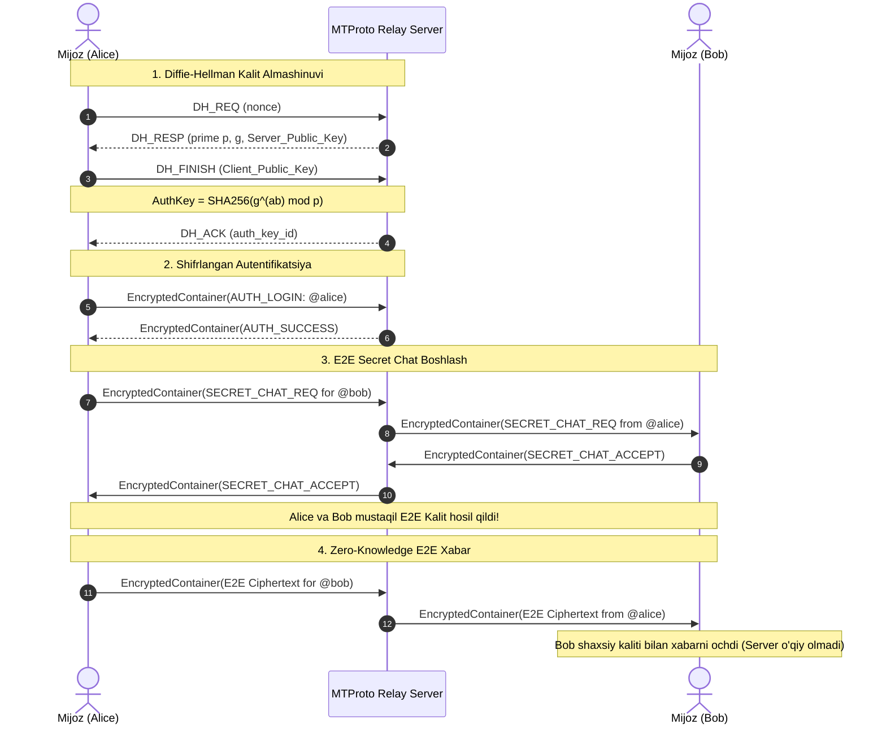

# ⚡ Telegram v1 (MTProto 1.0 from Scratch)

[](https://www.python.org/downloads/)
[]()
[-success.svg)]()
[]()

> **Dunyodagi eng mashhur dasturlarning v1 (Original MVP) arxitekturasini noldan yaratish seriyasi.**  
> Ushbu repozitoriy **Nikolai Durov** va **Pavel Durov** tomonidan 2013-yil avgust oyida yaratilgan **Telegram v1** (MTProto 1.0) protokolining sof Python va TCP soketlardagi fundamental implementatsiyasidir.

---

## 🏛️ Arxitektura va Tarixiy Asos

Telegram 2013-yilda taqdim etilganda uning asosiy kashfiyoti **MTProto (Mobile Transport Protocol)** bo'lgan. U mobil tarmoqlar (2G/3G) ning beqarorligi, xavfsizlik va yuqori tezlik talablariga javob berish uchun maxsus loyihalashtirilgan.

### Asosiy printsiplar:
1. **Diffie-Hellman Handshake**: Mijoz va Server tarmoq orqali maxfiy kalitni (`AuthKey`) ochiq uzatmasdan, matematika (katta tub sonlar va diskret logarifm) yordamida mustaqil hisoblab chiqaradi.
2. **MTProto v1 Simmetrik Shifrlash**: Har bir xabar uchun `msg_key = SHA256(auth_key + plaintext)[:16]` olinadi. AES-256-CBC orqali shifrlanadi. Deshifrlashda `msg_key` tekshiriladi (Integrity Verification).
3. **End-to-End Secret Chat**: Ikki foydalanuvchi serverni shunchaki tranzit vositasi qilib, o'zaro alohida ikkinchi Diffie-Hellman kalitini almashadi. **Server bu xabarlarni o'qiy olmaydi (Zero-Knowledge Relay)**.
4. **TCP Framing & CRC32**: Tarmoqdagi xatolar va fragmentatsiyadan himoyalanish uchun har bir paket `[Length: 4B] + [Payload] + [CRC32: 4B]` formatida uzatiladi.
5. **Oflayn Sinxronizatsiya (Updates/Sync)**: Foydalanuvchi tarmoqdan uzilganda xabarlar server qutisida saqlanadi va u qaytishi bilan avtomatik yetkaziladi.

---

## 🔄 Protokol Sxemasi (Sequence Diagram)



---

## 📂 Loyiha Tuzilmasi

```
telegram-v1/
├── telegram_v1/
│   ├── crypto/
│   │   ├── dh.py             # Diffie-Hellman Key Exchange (RFC 3526 2048-bit MODP)
│   │   └── cipher.py         # MTProto v1 AES-256-CBC & msg_key Integrity Check
│   ├── protocol/
│   │   ├── framing.py        # TCP Framing (Length prefix + CRC32 verification)
│   │   └── tl_schema.py      # Type Language (TL) packet schema & factories
│   ├── server/
│   │   ├── core.py           # Async TCP Relay Server (asyncio, high-concurrency)
│   │   ├── session.py        # ClientSession management & state
│   │   └── storage.py        # Message storage, groups, offline queue
│   └── client/
│       ├── core.py           # Async Client Engine (Handshake, Sync, E2E)
│       └── cli.py            # Rich ANSI Terminal Client (TUI)
├── tests/
│   ├── test_crypto.py        # DH va MTProto Cipher testlari
│   ├── test_protocol.py      # Framing va TL serializatsiya testlari
│   └── test_integration.py   # Client-Server to'liq hayotiy sikl testi
├── demo_simulation.py        # 1-klikli avtonom Alice & Bob simulyatsiyasi
├── run_server.py             # Serverni ishga tushiruvchi skript
├── run_client.py             # Interaktiv terminal chat mijozi
├── requirements.txt          # Minimal zaruriy kutubxonalar
└── README.md                 # Loyiha hujjatlari
```

---

## 🚀 Tezkor Ishga Tushirish

### 1. Bog'liqliklarni o'rnatish
```bash
pip install -r requirements.txt
```

### 2. Testlarni tekshirish (100% Yashil)
```bash
python -m pytest -v
```

### 3. Avtomatlashtirilgan Simulyatsiyani ko'rish
Serverni, Aliceni va Bobni ishga tushirib, ularning E2E maxfiy muloqotini ko'rish uchun:
```bash
python demo_simulation.py
```

### 4. Real Terminal Chat Rejimida Ishlatish

**1-terminalda Serverni yoqing:**
```bash
python run_server.py
```

**2-terminalda 1-foydalanuvchi (Alice) kiring:**
```bash
python run_client.py
```

**3-terminalda 2-foydalanuvchi (Bob) kiring:**
```bash
python run_client.py
```

---

## 💬 Terminal Buyruqlari (CLI Commands)

| Buyruq | Vazifasi |
|---|---|
| `/msg <user> <matn>` | Foydalanuvchiga to'g'ridan-to'g'ri (1-on-1) shifrlangan xabar yuborish |
| `/secret <user>` | Foydalanuvchi bilan **End-to-End Maxfiy Chat (E2E Secret Chat)** ochish |
| `/smsg <user> <matn>` | E2E chatda faqat qabul qiluvchi o'qiy oladigan xabar yuborish |
| `/users` | Hozirda onlayn bo'lgan barcha foydalanuvchilar ro'yxati |
| `<matn>` | Barcha a'zolar uchun umumiy `#general` kanaliga xabar yozish |
| `/help` | Mavjud buyruqlar ro'yxatini chiqarish |
| `/quit` | Tizimdan chiqish |

---

## 🛡️ Xavfsizlik Kafolatlari

- **Zero-Secret-Leakage**: Kod ichida hech qanday parollar yoki ochiq kalitlar hardcode qilinmagan.
- **Integrity Invariant**: Agar tarmoqdagi buzg'unchi shifrlangan xabardan bitta baytni o'zgartirsa ham, `msg_key` nomuvofiqligi tufayli xabar avtomatik rad etiladi.
- **Pure Python & Standard Crypto**: Faqat sanoat standarti bo'lgan `cryptography` kutubxonasidagi AES primitives va RFC 3526 DH standartlaridan foydalanilgan.

---
**Muallif:** Javohirbek Asqarov (Jasper)  
*From Scratch Software Archaeology Series*
